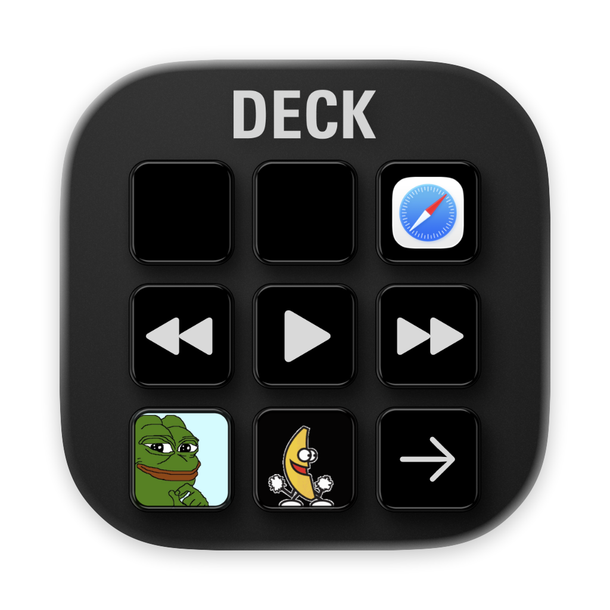

<p align="center">
  
</p>

<h1 align="center">Deck</h1>

<p align="center">
  A native macOS Stream Deck client built with Swift 6, SwiftUI, and IOKit.
</p>

Deck is a macOS 14+ replacement for Elgato's Electron-based Stream Deck app.  
It talks to real hardware over HID, renders button artwork natively, and keeps the configuration UI fast, local, and Mac-native.

## Open Source

Deck is open source under the MIT license. See [LICENSE](LICENSE).

## Highlights

- Native macOS menu bar app with dedicated settings windows
- Direct HID discovery and input handling for Stream Deck Mini, MK.2, and XL
- Native key image rendering pipeline with SwiftUI `ImageRenderer`
- Multi-page layouts with drag-reorder, page actions, and live button previews
- Configurable actions for apps, shortcuts, shell scripts, URLs, media controls, and page navigation
- Offline editing support with persistent layout storage
- No third-party dependencies

## Supported Hardware

| Device | Layout | Button image format |
| --- | --- | --- |
| Stream Deck Mini | 2 × 3 | BMP |
| Stream Deck MK.2 | 3 × 5 | JPEG |
| Stream Deck XL | 4 × 8 | JPEG |

## Current Feature Set

- HID connect and disconnect detection
- Physical button press and release handling
- Native button image upload over HID
- Per-device brightness for supported models
- Action assignment with live preview
- Drag and drop from the action library onto keys
- Drag and swap actions directly on the canvas
- Multi-page deck layouts with page controls and page actions
- Full-key app icons for `Launch App`
- System media key actions for play/pause, next, and previous

## Actions

- `Launch App`
- `Keystroke`
- `Shell Script`
- `Open URL`
- `Media`
- `Previous Page`
- `Next Page`
- `Go to Page`
- `Page Indicator`

## Architecture

```text
Deck/
├── App/         App entry point and runtime orchestration
├── HID/         Device discovery, input parsing, image sending
├── Renderer/    SwiftUI button rendering and image encoding
├── Actions/     Executable actions and shared action model
├── Layout/      Codable persistence and multi-page layout state
└── UI/          Configurator, inspector, grid, menu bar UI
```

## Build

### Requirements

- macOS 14 or later
- Xcode 17+
- Swift 6 toolchain

### Run locally

```bash
xcodebuild -project Deck.xcodeproj -scheme Deck -destination platform=macOS build CODE_SIGNING_ALLOWED=NO
```

Then open the project in Xcode and run the `Deck` scheme on your Mac.

## Contributing

Contributions are welcome. Start with [CONTRIBUTING.md](CONTRIBUTING.md).

## Permissions

Some actions depend on macOS privacy settings.

- `Keystroke` may require Accessibility and Input Monitoring access
- Shell-based and app-launch actions depend on the selected command or app
- Media actions send system media key events to the active media app

## Persistence

Deck stores its layout in:

```text
~/Library/Application Support/Deck/layout.json
```

The layout is editable even when no Stream Deck is connected. Changes sync to connected hardware automatically.

## Design Goals

- Feel like a real Mac app, not a web wrapper
- Keep HID and device-specific code isolated from the rest of the app
- Use Swift concurrency carefully around IOKit callbacks
- Prefer immediate visual feedback and low-friction editing

## Community

- Contribution guide: [CONTRIBUTING.md](CONTRIBUTING.md)
- Code of conduct: [CODE_OF_CONDUCT.md](CODE_OF_CONDUCT.md)
- Security policy: [SECURITY.md](SECURITY.md)

## Status

Deck is functional and still evolving. The core HID path, renderer, configurator, multi-page layout model, and action system are already in place, with room for more device coverage, deeper automation, and polish.
